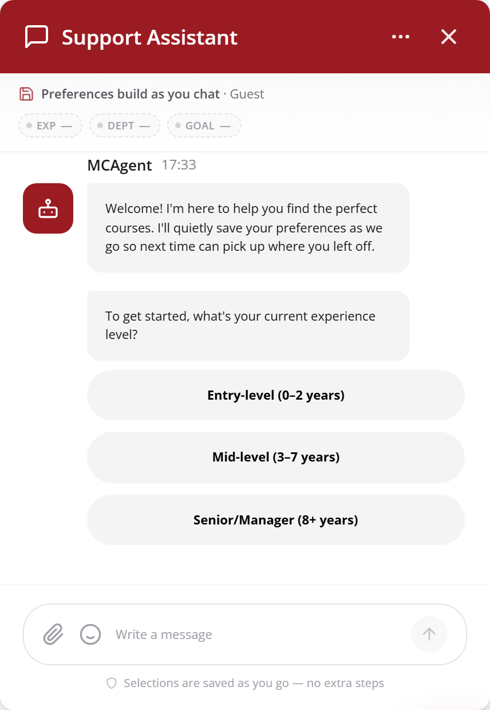
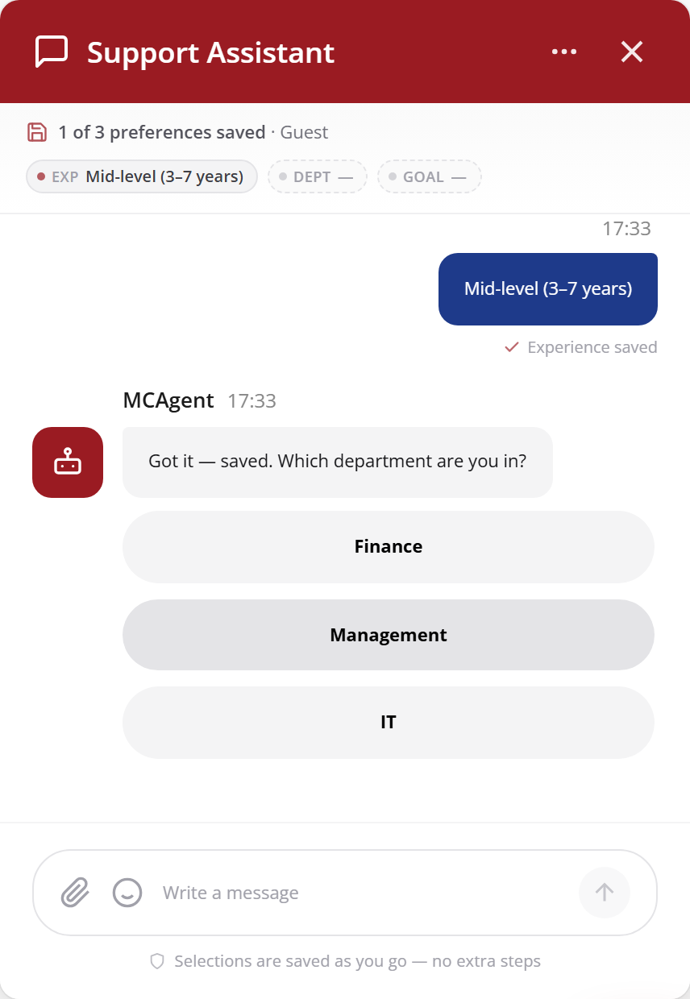
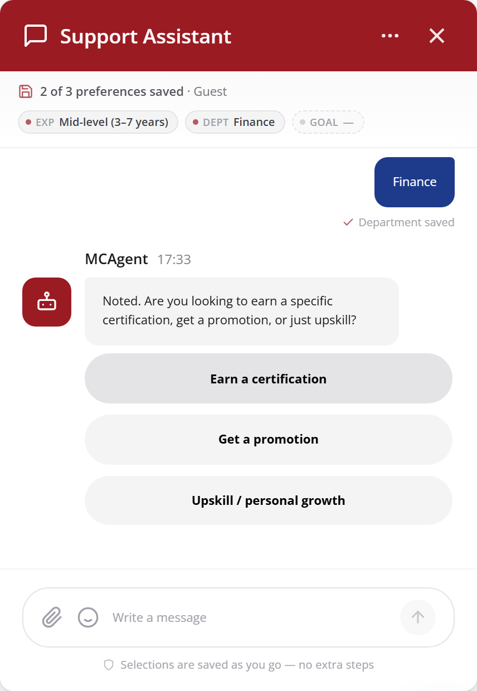
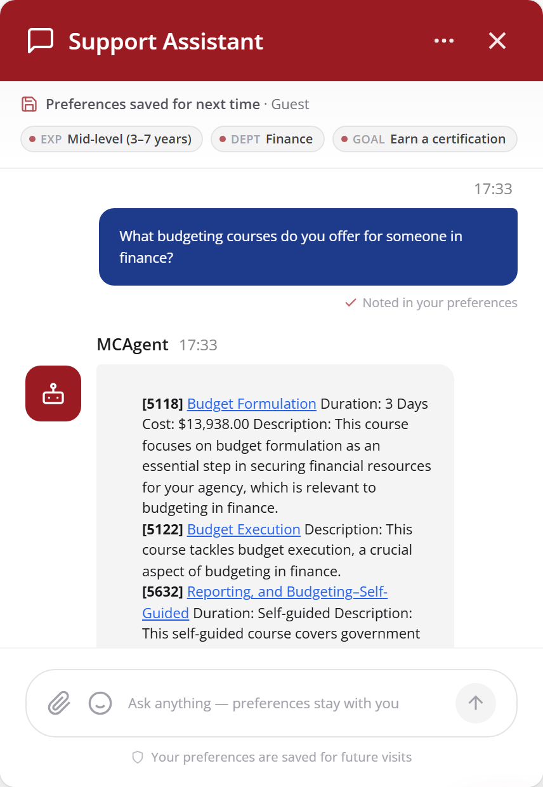
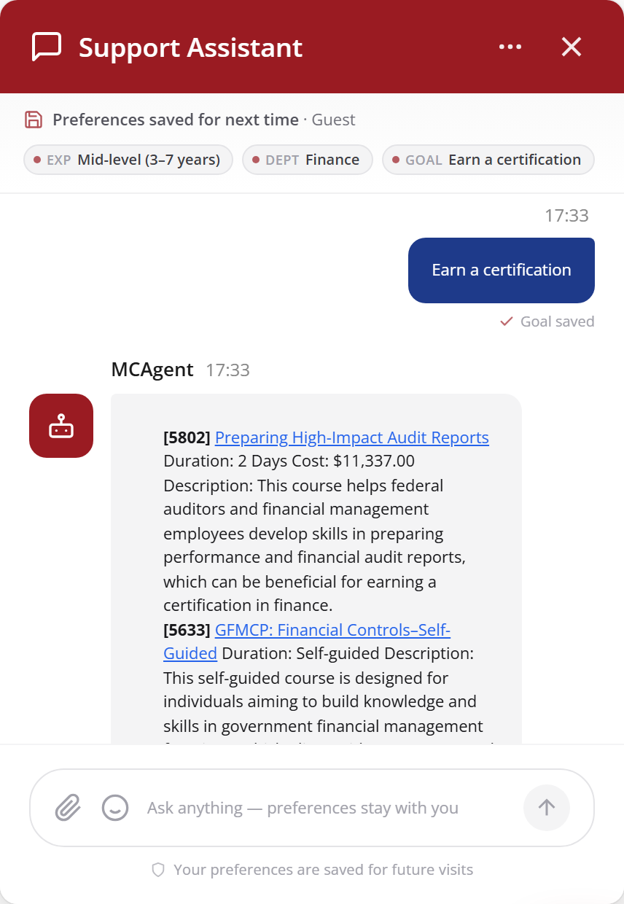
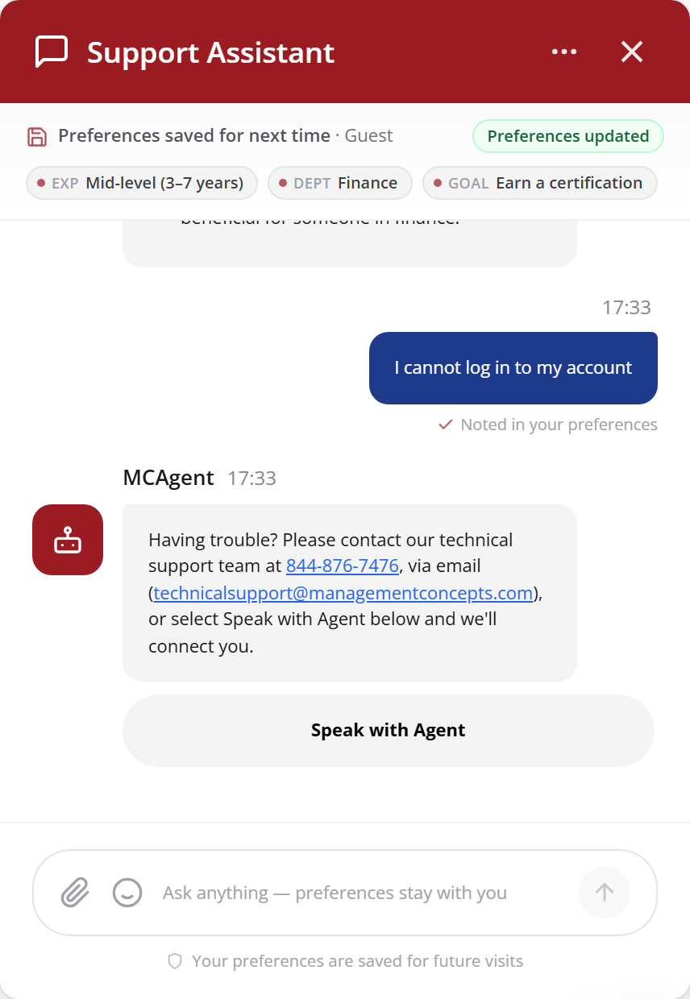
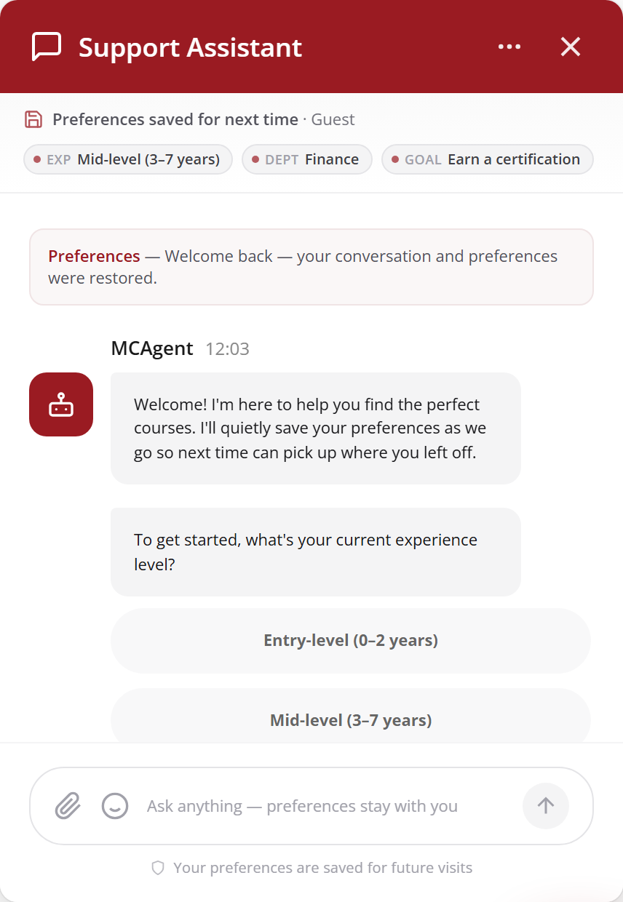

# MC AI Live Chat — Management Overview

**Product:** Management Concepts Course Advisor  
**Audience:** Leadership and stakeholders

---

## Executive Summary

MC AI Live Chat is a conversational course advisor for Management Concepts. Learners describe their training needs in plain language and receive a focused set of recommendations drawn from the live course catalog, including title, link, duration, cost, and delivery format when available.

The core outcome is a shorter path from uncertainty to a clear course shortlist — without catalog scrolling or waiting on email. A typical journey is:

**Open chat → Experience → Department → Goal → Course recommendations → Follow-ups → Course page**

---

## The Challenge

Large training catalogs create friction at the moment of highest intent. Learners often lack deep catalog familiarity, so they scroll, guess keywords, and overlook strong matches. When self-service fails, the fallback is email or phone, which slows momentum and forces repeated context-sharing. Internal teams absorb a high volume of routine “which course should I take?” questions, reducing capacity for complex advising. Return visits frequently restart from zero, adding further friction.

Together, these patterns lengthen time-to-course, increase drop-off, and leave demand signal underused.

---

## Our Solution

MC AI Live Chat provides always-on, catalog-grounded guidance through a branded chat experience. The advisor gathers a light profile, recommends real courses, supports natural follow-up, and hands off to support when the need falls outside course discovery.

How a session works:

- Three quick inputs: experience level, department, and career goal  
- A short ranked list of matching courses with key details  
- Free-text refinement (for example, virtual only or more entry-level)  
- Preferences retained for the next visit  
- Support handoff for non-course issues  

**Experience**

**Department**

**Goal**

**Suggestions**

Saved answers appear as chips at the top of the chat. Learners can adjust any chip to refresh recommendations without restarting the conversation.

---

## Key Capabilities

### Personalised Course Recommendations

Following onboarding, the advisor returns a concise shortlist tailored to level, department, and goal, with links and catalog details where available. Follow-up messages refine the list in place. Preferences persist for both guests and signed-in users.

### Automated Learning Path Generation

Today, the system surfaces multiple goal-aligned courses in a single shortlist and adjusts them through conversation. Planned expansion includes ordered multi-course paths, post-completion “what’s next” guidance, and team-oriented packages.

### Semantic Natural Language Search

Learners can ask in everyday language without course codes or exact titles — for example, budgeting options for finance, virtual entry-level offerings, or certification preparation. Questions outside course discovery are directed to support (phone, email, or Speak with Agent). Sessions and preferences can be restored after reload or on return.

---

## How the Engine Thinks

Recommendations are produced in a consistent sequence:

1. Capture learner context (experience, department, goal, and free-text signals).  
2. Search only within the Management Concepts catalog.  
3. Rank a short list of real courses that fit the request.  
4. Present the fit in plain language, with link, duration, and cost when known.  
5. Store the conversation and preferences for continuity.

The system does not invent courses, process enrollment, or take payment. Complex or out-of-scope needs are escalated to a person.

---

## System at a Glance

The product has three layers:

- **Website or portal** — branded chat where learners engage  
- **Course advisor** — conversation, ranking, and response generation  
- **Catalog and memory** — course content, chat history, and learner preferences  

The chat meets learners where they already are. The advisor performs matching. Catalog and memory keep answers grounded and support continuity across visits.

---

## Technology Snapshot

| Component | Specification |
|-----------|----------------|
| **Frontend** | React + Vite floating chat widget; SSE-style streaming from `POST /chat/stream`; session restore via `GET /session/{id}/history`; guest id in `localStorage` |
| **API service** | FastAPI (Uvicorn); optional `CHATBOT_API_PREFIX` and `X-API-Key`; routes for session, chat stream, history, learner profile, document/URL ingest |
| **RAG / retrieval** | LlamaIndex over catalog chunks; hybrid retrieval (vector + BM25) with ranking; answers grounded in retrieved course context only |
| **LLM** | Configurable provider: OpenRouter or Groq (`LLM_PROVIDER`) |
| **Embeddings** | Configurable: HuggingFace (`sentence-transformers/all-MiniLM-L6-v2` default), FastEmbed, OpenRouter, or OpenAI |
| **Data store** | PostgreSQL + pgvector (local or Supabase); tables for vector index, `chat_sessions`, `chat_messages`, `learner_profiles` |
| **Identity model** | `user_id` (registered) preferred over `guest_id` (anonymous); full transcripts always stored; condensed prefs updated on every turn |
| **Ingestion** | PDF / Markdown / TXT upload and URL ingest into the vector store without application rebuild |
| **Integration** | Standalone HTTP microservice (recommended), mountable FastAPI router, or React widget pointed at the API / BFF |
| **Runtime** | Python service; Docker-ready container; host apps never import LlamaIndex or embedding models when using the HTTP client |

---

## Business Value

| Metric | Before | After (directional) |
|--------|--------|---------------------|
| **Routine “which course?” load** | High share of advisor time on repeat questions | 20–35% reduction in routine tickets / email loops |
| **Time to a useful shortlist** | Catalog scroll, keyword guess, or multi-day reply | 40–60% faster path from first interest to a shortlist |
| **Demand signal** | Scattered in emails and untracked browse | Structured prefs (level, department, goal, topics) for catalog and marketing |

---

## Revenue Impact

Directional planning ranges for the first full year after production launch (not measured POC results). Replace with live analytics once available.

| Lever | Planning range |
|-------|----------------|
| **Course-page click-through** | 25–40% of recommendation sessions produce at least one course-page click |
| **Enrollment conversion** | 15–25% lift in inquiry/enrollment rate vs. browse-only baseline |
| **Return-visit conversion** | 10–20% higher conversion when preferences are already known |

---

## Future Scope

Near-to-medium opportunities include stronger multi-course learning paths, post-completion next-step guidance, integration with learning platforms and sales systems, cleaner guest-to-registered continuity, proactive course alerts, team and organization packages, and end-to-end visibility from first message through enrollment.

---

## Roadmap

| Phase | Timeline | Scope |
|-------|----------|-------|
| **Phase 1 — POC (Current)** | July 2026 | Core recommendation engine, semantic search, and learning path generation built on the existing course catalog with synthetic user data. Demonstrates feasibility and value. |
| **Phase 2 — Pilot** | August – September 2026 | Integrate with Management Concepts production catalog and real learner profiles. Deploy to a limited group of internal users for validation and feedback. |
| **Phase 3 — Production** | Q4 2026 | Embed the recommendation engine into the existing Management Concepts website, surfacing personalized recommendations, search, and learning paths directly within the learner experience. |
| **Phase 4 — Enhancement** | Q1 2027 | Google Analytics integration, skills gap analysis, A/B testing of recommendation strategies, and continuous model improvement based on learner engagement data. |
